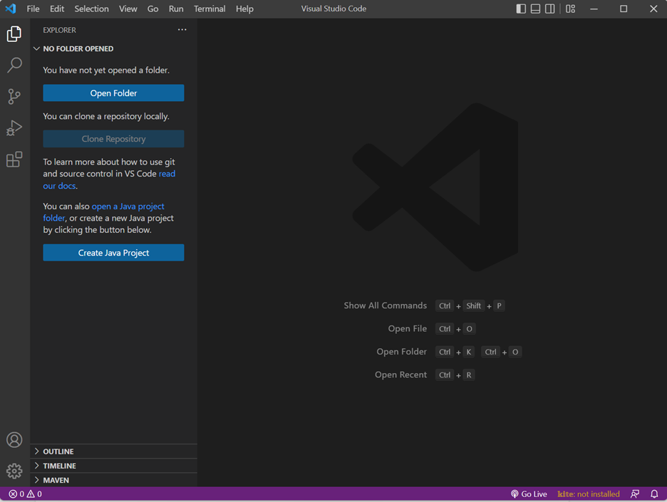
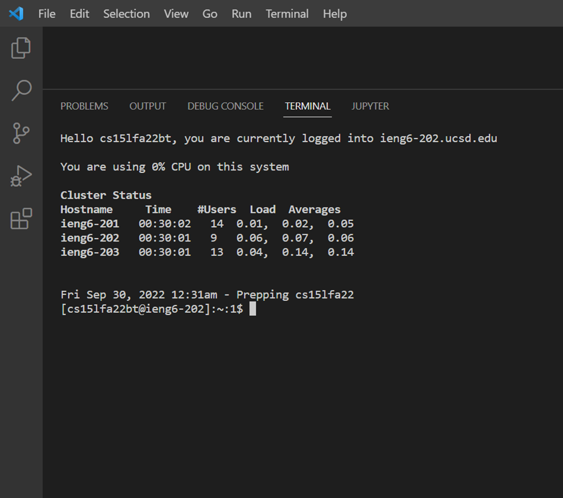
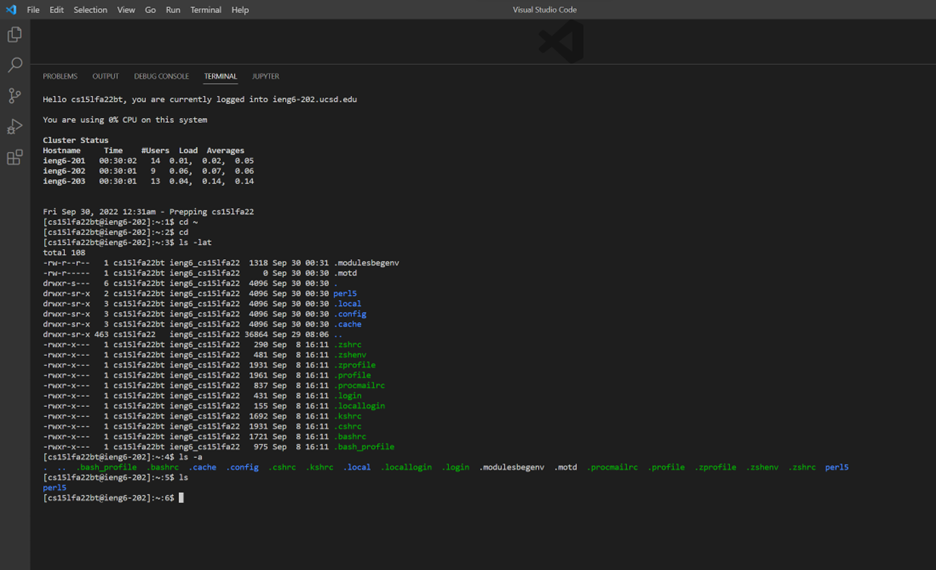
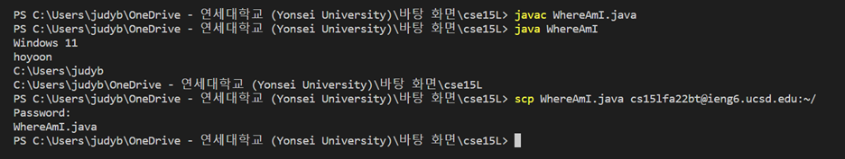
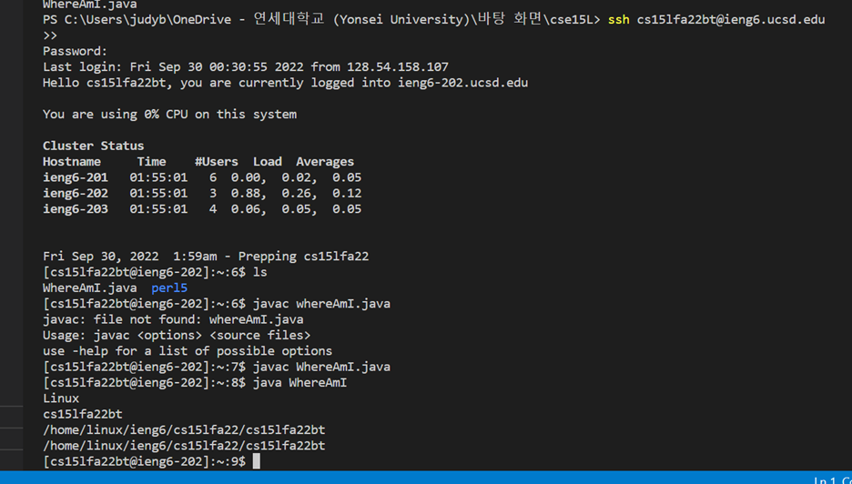
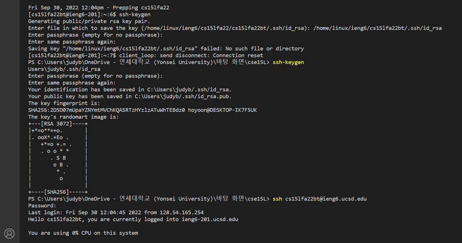
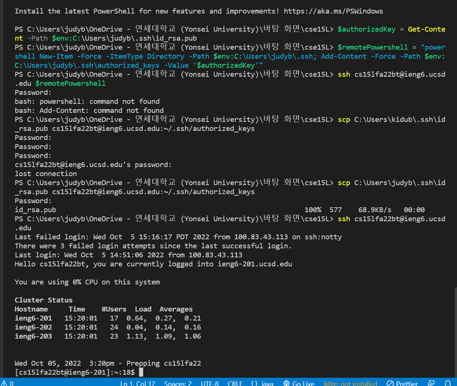
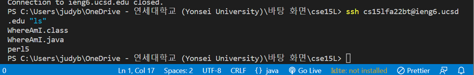

# Week 1 – Remote Access and the Filesystem  

> ## Installing VScode    

  
    

We started from installing the VScode in this [Link](https://code.visualstudio.com/). VScode is basically a source-code editor which will help your development operations.  

> ## Remotely Connecting  

After we make sure that OpenSSH is installed in our computer, we should open a VScode terminal and type 

`$ ssh cs15lfa22zz@ieng6.ucsd.edu`

but replace 'zz' to your own account letters.

After that if you type your password, you can login to SSH.

  
  
    

> ## Trying Some Commands  
  
    

After logging into SSH, we can try some commands on the remote computer.
I ran commands cd ~, ls -lat, ls, ls -a on my remote computer, and here are the brief explanations what each command does.
* cd ~  : move to the home directory
* ls  : list files or directories in the current directory
* ls -lat  : lists files stored in current directory vertically with the last modification date
* ls -a  : list files stored in current directory without the last modification date

> ## Moving Files with scp  
  
    

We can move our files from our compter to a remote computer by using a command scp. In the lab, we made a file WhereAmI.java, and then compile and run. `scp WhereAmI.java cs15lfa22zz@ieng6.ucsd.edu:~/` Run this command with a replacement of 'zz'

Then we can log into our remote computer account server by ssh and see that the file WhereAmI.java exists and can run the file by command javac and java.
  
    

> ## Setting an SSH Key  
  
    

We can generate the key pair by a command ssh-keygen and log in without password. but unfortunately I couldn’t. I guess I need to do more extra procedures for the window computer. 

For me, I went through the extra ssh-add steps for the window following this [Link](https://docs.microsoft.com/en-us/windows-server/administration/openssh/openssh_keymanagement#user-key-generation). Then we should store this private key and public key in a directory in order to login to ssh without typing the password everytime.  
  

  

> ## Optimizing Remote Running
  
    
      

After setting the SSH key and logging in without the password, we can use the command in the remote server very easily. By this command on the picture, we can run the command ls in the remote server and exit. We can see the contents in our remote account server.