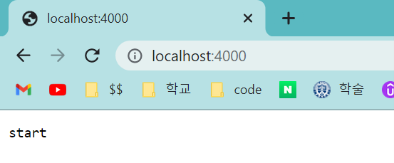
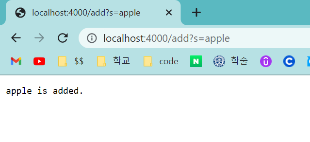
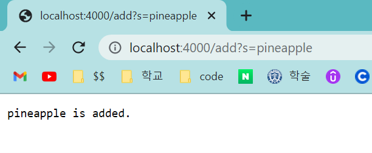
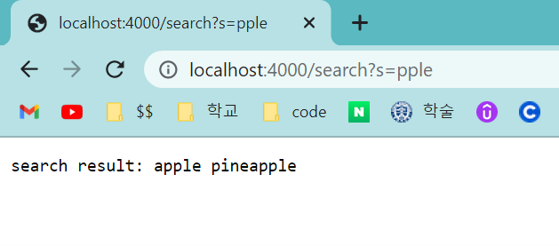
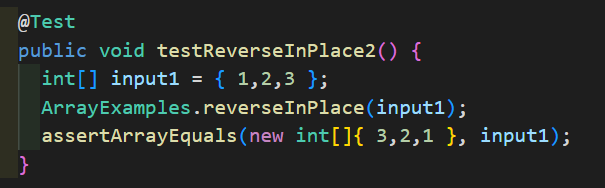
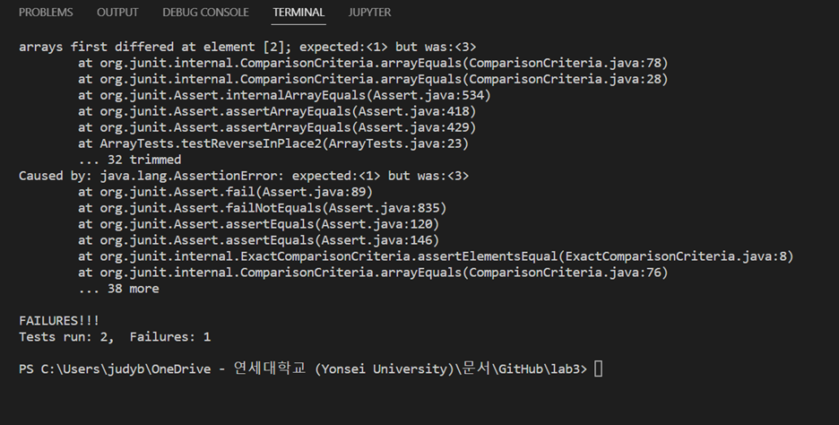
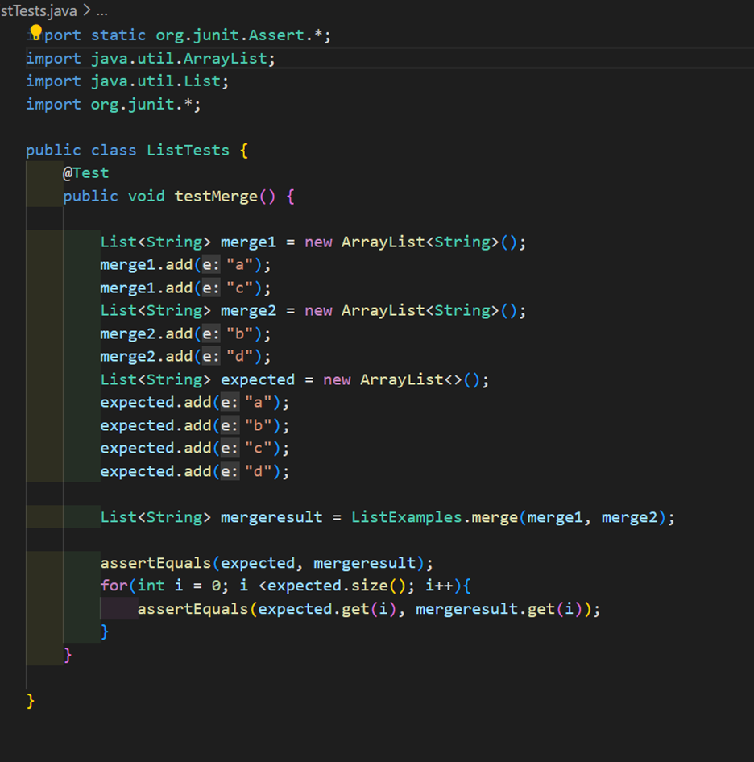
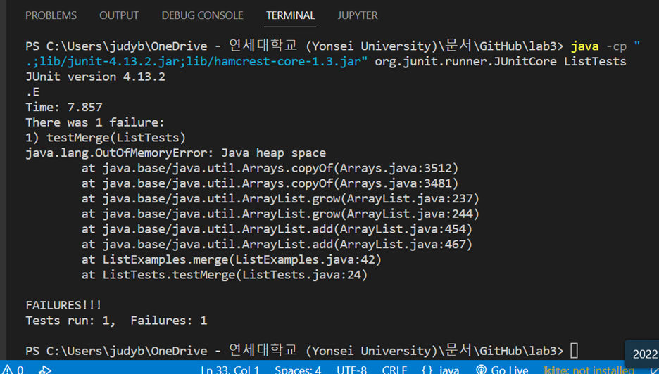
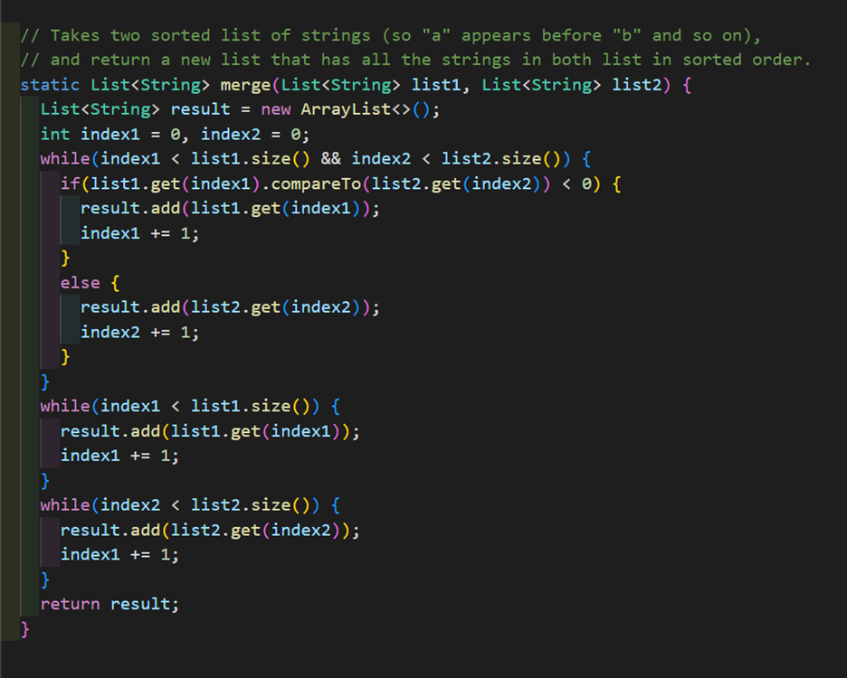

# Week 3 Lab Report

> ## part1 - week2  

```
import java.io.IOException;
import java.net.URI;
import java.util.ArrayList;

class Handler implements URLHandler {
    // The one bit of state on the server: a number that will be manipulated by
    // various requests.
    ArrayList<String> strList = new ArrayList<>(); 

    public String handleRequest(URI url) {
        if (url.getPath().equals("/")) {
            return "start";
        } else {
            System.out.println("Path: " + url.getPath());
            if (url.getPath().contains("/add")) {
                String[] parameters = url.getQuery().split("=");
                if (parameters[0].equals("s")) {
                    strList.add(parameters[1]);
                    return parameters[1]+" is added.";
                }
            } else if (url.getPath().contains("/search")) {
                String[] parameters = url.getQuery().split("=");
                if (parameters[0].equals("s")) {
                    // ArrayList<String> searchList = new ArrayList<>(); 
                    String returnString = "";
                    for (String i :strList){
                        if(i.contains(parameters[1])){
                            returnString += i + " ";
                        }
                    }
                    
                    
                    return "search result: " + returnString;
                }

            } 
            return "404 Not Found!";
        }
    }
}

class SearchEngine {
    public static void main(String[] args) throws IOException {
        if(args.length == 0){
            System.out.println("Missing port number! Try any number between 1024 to 49151");
            return;
        }

        int port = Integer.parseInt(args[0]);

        Server.start(port, new Handler());
    }
}
```  
  
  


If we call the path "/" after the `localhost:4000`, the handleRequest method is called, and because `if (url.getPath().equals("/"))` is true in this case, the page returns `start`.

If we call the path "/add" after the `localhost:4000`, the handleRequest method is called, and because `if (url.getPath().contains("/add"))` is true, the query gets splited by "=" into two. If the first part of splited query is "s", the last part of the query is added tothe strList. So in this case, "apple" is added to the strList and the page returns "apple is added."
 This case acts same as upper case, so "pineapple" is also added to the strList.

If we call the path "/search" after the `localhost:4000`, the handleRequest method is called, and because `if (url.getPath().contains("/search"))` is true, the query gets splited by "=" into two. If the first part of splited query is "s", the page returns the elements that contain the last part of the splited query(in this case, "pple") in the list strList.


> ## part2 - week3

The failure-inducing input

The symptom 

```
// Changes the input array to be in reversed order
  static void reverseInPlace(int[] arr) {
    for(int i = 0; i < arr.length; i += 1) {
      arr[i] = arr[arr.length - i - 1];
    }
  }
```
The bug

```
  // Changes the input array to be in reversed order
  static void reverseInPlace(int[] arr) {
    int[] newArray = new int[arr.length];
    for(int i = 0; i < arr.length; i += 1) {
      newArray[i] = arr[arr.length - i - 1];
    }
    for(int i = 0; i < arr.length; i += 1) {
      arr[i] = newArray[i];
    }
  }
```
Fixed code


 the connection between the symptom and the bug -  
The bug makes this symptom because unlike the objective to make the array reverse, all of the elements in the array except for the middle element go through the reversing twice in the for loop. So this symptom occurs because unlike we expected the first index of the list to be in the last index, the original last index stays the same.


  
The failure-inducing input  


The symptom 


The bug


 the connection between the symptom and the bug -  
The bug makes this symptom because the bug made the non-terminating code until the limited memory. 
